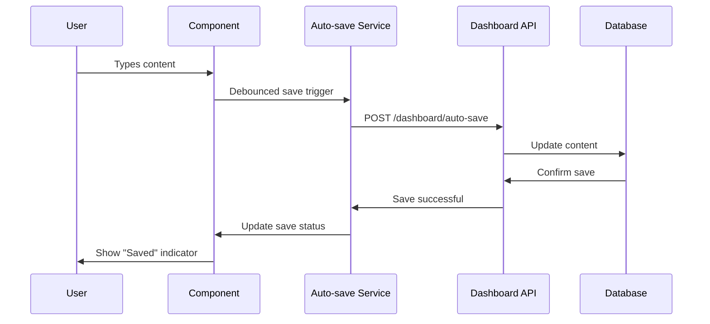
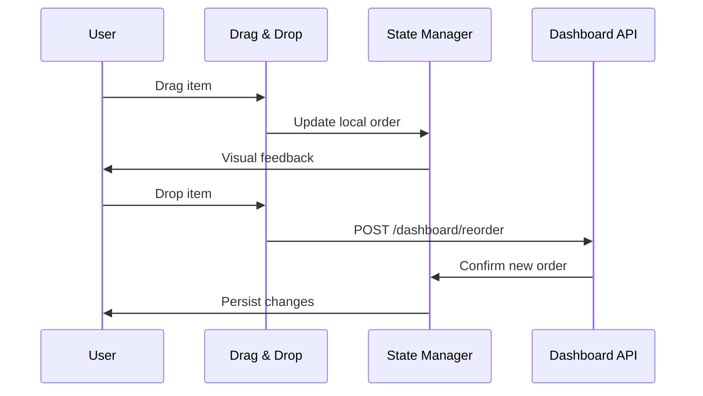

# Design Document

## Overview

The EPK Builder Dashboard is designed as a modern, intuitive content management interface that follows the dark theme with glass morphism aesthetic. Built with Next.js 15 App Router and Tailwind CSS, the dashboard provides a seamless editing experience with real-time updates, drag-and-drop functionality, and responsive design. The interface emphasizes content-first design principles while maintaining clarity and minimalism throughout the user experience.

## Architecture

### High-Level Architecture

```mermaid
graph TB
    Client[Next.js Dashboard] --> API[Dashboard API Layer]
    API --> Auth[Auth Middleware]
    API --> Tier[Tier Validation]
    
    subgraph Dashboard Services
        Content[Content Service]
        Media[Media Service]
        Analytics[Analytics Service]
        Preview[Preview Service]
    end
    
    API --> Dashboard Services
    
    Content --> MongoDB[(MongoDB)]
    Media --> Cloudinary[Cloudinary CDN]
    Analytics --> Analytics[(Analytics DB)]
    Preview --> Cache[Redis Cache]
    
    subgraph Real-time Features
        AutoSave[Auto-save Service]
        LivePreview[Live Preview]
        ProgressTrack[Progress Tracking]
    end
    
    Dashboard Services --> Real-time Features
```

### Frontend Architecture

The dashboard follows a modular component architecture with:

1. **Layout Components**: Navigation, sidebar, header with user context
2. **Editor Components**: Rich text editors, drag-and-drop interfaces, form components
3. **Preview Components**: Real-time preview rendering, responsive breakpoint testing
4. **Analytics Components**: Charts, metrics displays, export functionality

### State Management

Using Zustand for global state management:

```typescript
interface DashboardState {
  user: User;
  epkData: EPKData;
  currentSection: string;
  unsavedChanges: boolean;
  previewMode: boolean;
  tierLimits: TierLimits;
}
```

## Components and Interfaces

### Dashboard Layout Component

**Purpose**: Main layout wrapper with navigation and user context

**Key Features**:
- Dark theme with glass morphism navigation
- Responsive sidebar with collapsible sections
- User tier display with upgrade prompts
- Real-time save status indicator
- Breadcrumb navigation

**Component Structure**:
```typescript
interface DashboardLayoutProps {
  children: React.ReactNode;
  currentSection: string;
  user: User;
  unsavedChanges: boolean;
}
```

### Bio Editor Component

**Purpose**: Rich text editor for artist biography with auto-save

**Technical Implementation**:
- TipTap editor with custom styling for dark theme
- Auto-save every 30 seconds using debounced API calls
- Character count with tier-based limits
- Link validation and preview functionality
- Markdown export capability

**Component Interface**:
```typescript
interface BioEditorProps {
  initialContent: string;
  characterLimit: number;
  onSave: (content: string) => Promise<void>;
  onAutoSave: (content: string) => void;
}
```

### Photo Gallery Manager

**Purpose**: Drag-and-drop photo management with gallery organization

**Key Features**:
- React DnD for drag-and-drop functionality
- Image upload with progress indicators
- Gallery categorization (Live, Studio, Promo, Behind-the-Scenes)
- Bulk operations (select, delete, move)
- Cloudinary integration for optimization
- Alt text management for SEO

**Gallery Structure**:
```typescript
interface Gallery {
  id: string;
  name: string;
  category: GalleryCategory;
  photos: Photo[];
  coverPhoto?: string;
  isPublic: boolean;
}

interface Photo {
  id: string;
  url: string;
  thumbnailUrl: string;
  altText: string;
  uploadedAt: Date;
  size: number;
  dimensions: { width: number; height: number };
}
```

### Music Track Manager

**Purpose**: Music track organization with streaming platform integration

**Features**:
- Drag-and-drop track reordering
- Streaming platform URL validation and metadata fetching
- Audio file upload with format validation
- Track categorization (Album, Single, Demo)
- Embedded player preview
- Public/private visibility controls

**Track Interface**:
```typescript
interface Track {
  id: string;
  title: string;
  artist: string;
  album?: string;
  duration?: number;
  streamingLinks: StreamingLink[];
  audioFile?: string;
  isPublic: boolean;
  category: TrackCategory;
  order: number;
}

interface StreamingLink {
  platform: StreamingPlatform;
  url: string;
  verified: boolean;
}
```

### Contact Information Manager

**Purpose**: Comprehensive contact and social media management

**Features**:
- Multiple contact types (Booking, Press, Management)
- Social media link validation with platform detection
- Team member management with role assignments
- Contact form customization
- Email template management

**Contact Structure**:
```typescript
interface ContactInfo {
  booking: ContactDetails;
  press: ContactDetails;
  management: ContactDetails;
  socialMedia: SocialMediaLink[];
  teamMembers: TeamMember[];
}

interface ContactDetails {
  name: string;
  email: string;
  phone?: string;
  company?: string;
  role: string;
}
```

### Rider Template System

**Purpose**: Professional rider creation with industry templates

**Features**:
- Template library with venue-specific options
- Drag-and-drop section builder
- Rich text editing for custom requirements
- PDF generation with professional styling
- Version control and template management
- Secure sharing with access tracking

**Rider Structure**:
```typescript
interface Rider {
  id: string;
  name: string;
  template: RiderTemplate;
  sections: RiderSection[];
  lastModified: Date;
  version: number;
  isActive: boolean;
}

interface RiderSection {
  id: string;
  title: string;
  content: string;
  type: SectionType;
  required: boolean;
  order: number;
}
```

### Live Preview System

**Purpose**: Real-time EPK preview with responsive testing

**Technical Implementation**:
- Server-side rendering for accurate preview
- WebSocket connection for real-time updates
- Responsive breakpoint simulation
- Performance metrics display
- SEO preview with meta tag validation

**Preview Interface**:
```typescript
interface PreviewState {
  mode: 'desktop' | 'tablet' | 'mobile';
  isLive: boolean;
  lastUpdate: Date;
  performanceMetrics: PerformanceMetrics;
  seoScore: SEOScore;
}
```

## Data Models

### EPK Data Structure

```typescript
interface EPKData {
  id: string;
  userId: string;
  artistName: string;
  bio: string;
  galleries: Gallery[];
  tracks: Track[];
  contactInfo: ContactInfo;
  riders: Rider[];
  settings: EPKSettings;
  analytics: AnalyticsData;
  lastModified: Date;
  isPublished: boolean;
}

interface EPKSettings {
  theme: string;
  customDomain?: string;
  seoSettings: SEOSettings;
  privacySettings: PrivacySettings;
  socialSharing: boolean;
}
```

### Auto-save System



### Drag-and-Drop Flow



## Error Handling

### Client-Side Error Handling

**Error Boundary Implementation**:
```typescript
interface ErrorBoundaryState {
  hasError: boolean;
  error?: Error;
  errorInfo?: ErrorInfo;
}
```

**Error Types**:
- Network connectivity errors
- File upload failures
- Validation errors
- Auto-save conflicts
- Tier limit exceeded errors

### User-Friendly Error Messages

**Error Display Strategy**:
- Toast notifications for temporary errors
- Inline validation for form errors
- Modal dialogs for critical errors
- Retry mechanisms for network failures
- Graceful degradation for feature unavailability

### Data Recovery

**Auto-save Recovery**:
- Local storage backup for unsaved changes
- Conflict resolution for concurrent edits
- Version history for content recovery
- Offline mode with sync on reconnection

## Testing Strategy

### Component Testing

**Key Test Areas**:
- Rich text editor functionality and auto-save
- Drag-and-drop interactions and state updates
- File upload progress and error handling
- Form validation and submission
- Responsive design across breakpoints

**Testing Tools**:
- Jest for unit tests
- React Testing Library for component tests
- Playwright for end-to-end testing
- Storybook for component documentation

### Integration Testing

**Dashboard Workflow Tests**:
- Complete EPK creation flow
- Content editing and auto-save functionality
- Preview generation and accuracy
- Tier limit enforcement
- Analytics data collection

### Performance Testing

**Optimization Targets**:
- Initial page load: <2 seconds
- Auto-save response: <500ms
- Image upload processing: <3 seconds per image
- Preview generation: <1 second
- Dashboard navigation: <200ms

**Performance Monitoring**:
- Core Web Vitals tracking
- Bundle size optimization
- Image loading optimization
- API response time monitoring

### Accessibility Testing

**WCAG 2.1 Compliance**:
- Keyboard navigation support
- Screen reader compatibility
- Color contrast validation
- Focus management
- ARIA labels and descriptions

**Testing Tools**:
- axe-core for automated accessibility testing
- Manual testing with screen readers
- Keyboard-only navigation testing
- Color blindness simulation