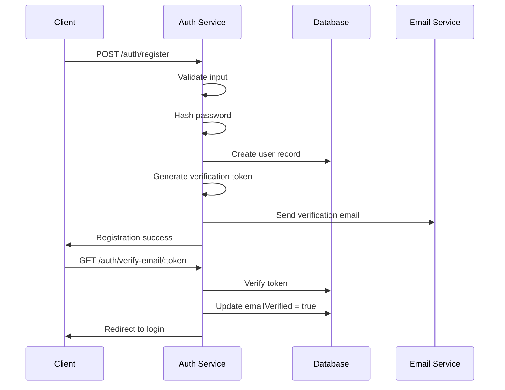
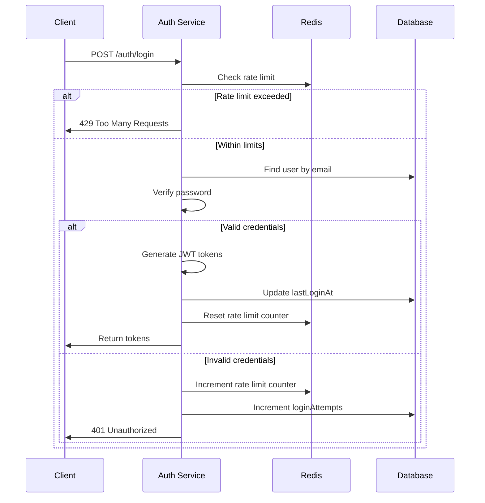
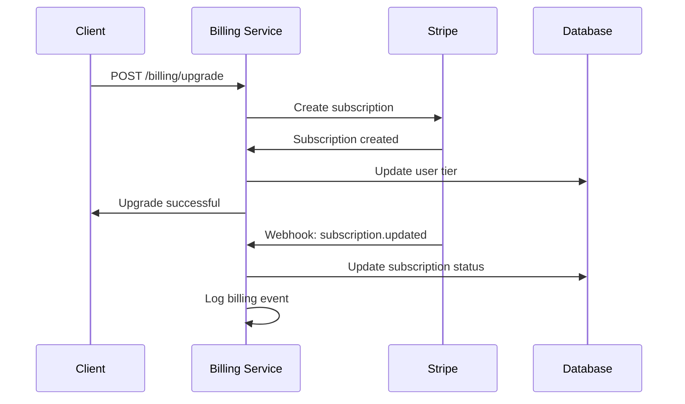

# Design Document

## Overview

The User Authentication & Tier Management system is built as a secure, scalable authentication service that integrates with Stripe for subscription management. The system follows JWT-based stateless authentication with secure password handling, rate limiting, and comprehensive audit logging. The architecture supports both web and mobile clients while maintaining consistent security standards across all platforms.

## Architecture

### High-Level Architecture

```mermaid
graph TB
    Client[Web/Mobile Client] --> Gateway[API Gateway]
    Gateway --> Auth[Auth Service]
    Gateway --> User[User Service]
    Gateway --> Billing[Billing Service]
    
    Auth --> Redis[Redis Cache]
    User --> MongoDB[(MongoDB)]
    Billing --> Stripe[Stripe API]
    
    Auth --> Email[Email Service]
    Email --> SendGrid[SendGrid]
    
    subgraph Security Layer
        RateLimit[Rate Limiting]
        Validation[Input Validation]
        Encryption[Data Encryption]
    end
    
    Gateway --> Security Layer
```

### Service Architecture

The authentication system is organized into distinct services:

1. **Authentication Service**: Handles login, registration, password reset, and JWT token management
2. **User Management Service**: Manages user profiles, preferences, and account settings
3. **Billing Service**: Integrates with Stripe for subscription management and tier enforcement
4. **Email Service**: Handles transactional emails for verification and notifications

## Components and Interfaces

### Authentication Controller

**Purpose**: Handles all authentication-related HTTP requests

**Key Methods**:
- `POST /auth/register` - User registration with email verification
- `POST /auth/login` - User authentication with rate limiting
- `POST /auth/logout` - Token invalidation and session cleanup
- `POST /auth/refresh` - JWT token refresh
- `POST /auth/forgot-password` - Password reset initiation
- `POST /auth/reset-password` - Password reset completion
- `GET /auth/verify-email/:token` - Email verification

**Security Features**:
- Rate limiting: 5 attempts per 15 minutes per IP for login
- Input validation using express-validator
- CSRF protection for web clients
- Secure HTTP headers via Helmet.js

### User Model

**MongoDB Schema**:
```typescript
interface User {
  _id: ObjectId;
  email: string; // unique, indexed
  password: string; // bcrypt hashed
  firstName: string;
  lastName: string;
  artistName?: string;
  tier: 'free' | 'premium' | 'pro';
  stripeCustomerId?: string;
  subscriptionId?: string;
  subscriptionStatus: 'active' | 'canceled' | 'past_due' | 'unpaid';
  emailVerified: boolean;
  emailVerificationToken?: string;
  passwordResetToken?: string;
  passwordResetExpires?: Date;
  loginAttempts: number;
  lockUntil?: Date;
  createdAt: Date;
  updatedAt: Date;
  lastLoginAt?: Date;
}
```

**Indexes**:
- `email` (unique)
- `stripeCustomerId` (sparse)
- `emailVerificationToken` (sparse, TTL)
- `passwordResetToken` (sparse, TTL)

### JWT Token Structure

**Access Token Payload**:
```typescript
interface JWTPayload {
  userId: string;
  email: string;
  tier: string;
  iat: number; // issued at
  exp: number; // expires (15 minutes)
}
```

**Refresh Token Payload**:
```typescript
interface RefreshTokenPayload {
  userId: string;
  tokenVersion: number;
  iat: number;
  exp: number; // expires (7 days)
}
```

### Tier Management Service

**Purpose**: Enforces feature access based on subscription tiers

**Tier Definitions**:
```typescript
const TIER_LIMITS = {
  free: {
    photoGalleries: 3,
    musicTracks: 5,
    storageLimit: 500 * 1024 * 1024, // 500MB
    customDomain: false,
    analytics: false,
    teamCollaboration: false
  },
  premium: {
    photoGalleries: Infinity,
    musicTracks: Infinity,
    storageLimit: 5 * 1024 * 1024 * 1024, // 5GB
    customDomain: true,
    analytics: true,
    teamCollaboration: false
  },
  pro: {
    photoGalleries: Infinity,
    musicTracks: Infinity,
    storageLimit: 10 * 1024 * 1024 * 1024, // 10GB
    customDomain: true,
    analytics: true,
    teamCollaboration: true
  }
};
```

### Stripe Integration Service

**Purpose**: Manages subscription lifecycle and billing events

**Key Methods**:
- `createCustomer(user)` - Create Stripe customer
- `createSubscription(customerId, priceId)` - Start subscription
- `updateSubscription(subscriptionId, priceId)` - Upgrade/downgrade
- `cancelSubscription(subscriptionId)` - Cancel at period end
- `handleWebhook(event)` - Process Stripe webhooks

**Webhook Events Handled**:
- `customer.subscription.created`
- `customer.subscription.updated`
- `customer.subscription.deleted`
- `invoice.payment_succeeded`
- `invoice.payment_failed`

## Data Models

### User Authentication Flow



### Login Flow with Rate Limiting



### Subscription Management Flow



## Error Handling

### Authentication Errors

**Error Response Format**:
```typescript
interface AuthError {
  error: string;
  message: string;
  code: string;
  details?: any;
}
```

**Common Error Codes**:
- `AUTH_001`: Invalid credentials
- `AUTH_002`: Account locked due to failed attempts
- `AUTH_003`: Email not verified
- `AUTH_004`: Token expired or invalid
- `AUTH_005`: Rate limit exceeded
- `AUTH_006`: Insufficient permissions for tier

### Error Handling Strategy

1. **Client Errors (4xx)**: Return descriptive error messages without exposing sensitive information
2. **Server Errors (5xx)**: Log detailed error information, return generic error message to client
3. **Validation Errors**: Return field-specific validation messages
4. **Rate Limiting**: Return retry-after header with appropriate delay

## Testing Strategy

### Unit Tests

**Authentication Service Tests**:
- Password hashing and verification
- JWT token generation and validation
- Rate limiting logic
- Input validation schemas
- Email verification token generation

**User Model Tests**:
- Schema validation
- Index performance
- Data encryption/decryption
- Tier limit enforcement

### Integration Tests

**API Endpoint Tests**:
- Registration flow with email verification
- Login flow with various scenarios (valid, invalid, locked account)
- Password reset flow
- Subscription upgrade/downgrade flows
- Webhook processing

**Database Tests**:
- User creation and retrieval
- Index usage optimization
- Transaction handling for critical operations

### Security Tests

**Authentication Security**:
- Brute force attack protection
- SQL injection prevention
- XSS protection in user inputs
- CSRF token validation
- JWT token security (expiration, signature validation)

**Rate Limiting Tests**:
- Rate limit enforcement across different endpoints
- Rate limit bypass attempts
- Distributed rate limiting with Redis

### Performance Tests

**Load Testing Scenarios**:
- Concurrent user registration (1000 users/minute)
- Concurrent login attempts (5000 requests/minute)
- JWT token validation performance
- Database query optimization under load

**Monitoring Metrics**:
- Authentication response times (target: <200ms)
- Database connection pool utilization
- Redis cache hit rates
- Stripe API response times